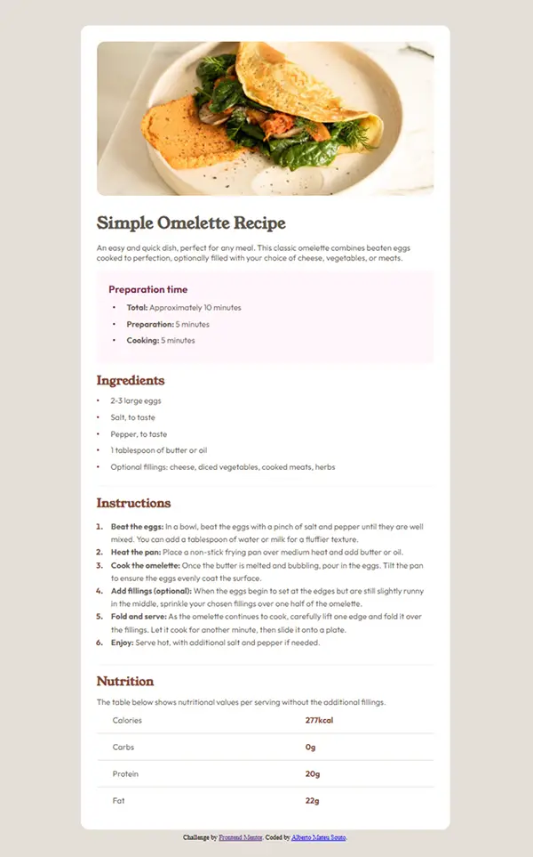

# Frontend Mentor - Solución a la página de receta

Esta es una solución al [reto de la página de receta en Frontend Mentor](https://www.frontendmentor.io/challenges/recipe-page-iTsJrcSQcW). Los retos de Frontend Mentor ayudan a mejorar las habilidades de programación construyendo proyectos realistas.

## Tabla de contenidos

- [Vista general](#vista-general)
  - [Captura de pantalla](#captura-de-pantalla)
  - [Enlaces](#enlaces)
- [Mi proceso](#mi-proceso)
  - [Construido con](#construido-con)
  - [Lo que aprendí](#lo-que-aprendí)
  - [Agradecimientos](#agradecimientos)
  - [Desarrollo futuro](#desarrollo-futuro)
- [Autor](#autor)

## Vista general

### Captura de pantalla

### Enlaces

- URL de la solución: [Añade aquí la URL de tu solución](https://your-solution-url.com)
- URL del sitio en vivo: [Añade aquí la URL de tu sitio web](https://your-live-site-url.com)

## Mi proceso

### Construido con

- Marcado HTML5 semántico
- Propiedades personalizadas de CSS (Variables)
- Flexbox
- Enfoque "Mobile-first" (Primero móvil)
- Tipografía personalizada con `@font-face` (Young Serif y Outfit)
- Media Queries para diseño responsivo en escritorio

### Lo que aprendí

Construir esta página de recetas ha sido un viaje increíble para pulir la estructura HTML y dominar técnicas avanzadas de CSS. Algunos de los aprendizajes clave y retos superados durante este proyecto incluyen:

- **Arquitectura de cajas y maquetación profesional:** Gestionar un diseño fluido que transiciona sin problemas desde una vista móvil de ancho completo hasta una tarjeta centrada y con marco en pantallas de escritorio utilizando CSS Flexbox.
- **Estructuración con Tablas y Listas HTML:** 
  - Uso correcto de **tablas (`<table>`, `<tbody>`, `<tr>`, `<th>`, `<td>`)** con el atributo `scope="row"` para accesibilidad, mostrando la información nutricional de forma limpia y con bordes personalizados utilizando selectores como `first-child` y `last-child`.
  - Implementación avanzada de **listas desordenadas (`<ul>`)** para los ingredientes y tiempos de preparación, estilizándolas con viñetas personalizadas mediante `::before`.
  - Dominio de **listas ordenadas (`<ol>`)** para las instrucciones paso a paso, utilizando el pseudo-elemento `::marker` para darles un toque de diseño profesional a los números.
- **Selectores avanzados de CSS:** Utilización de pseudo-elementos como `::before` para viñetas de listas personalizadas y `::marker` para dar estilo a los números de las listas ordenadas de forma limpia.
- **Integración tipográfica:** Implementar archivos de fuentes locales de manera eficiente usando `@font-face` junto con variables CSS para mantener un sistema de diseño limpio y escalable.

## Agradecimientos
Quiero expresar mi más sincero agradecimiento a **eestaniel** por su valioso feedback durante el desarrollo de este proyecto. Sus observaciones han sido fundamentales para mejorar la calidad y la estructura de mi código.

### ¿Qué he aprendido gracias a este feedback?
Gracias a sus sugerencias, he podido implementar las siguientes mejoras clave que aplicaré en mis futuros proyectos:

* **Arquitectura CSS profesional:** He aprendido a organizar el código en bloques lógicos (Tokens, Base, Componentes y Breakpoints), lo que facilita enormemente el mantenimiento y la legibilidad.
* **Accesibilidad semántica:** He profundizado en la importancia de etiquetas como `<th>` con el atributo `scope="row"` para que las tablas sean interpretadas correctamente por tecnologías de asistencia.
* **Buenas prácticas en accesibilidad:** He implementado estilos de `:focus-visible` para garantizar una navegación clara mediante teclado y he ajustado el uso de tipografía y colores para asegurar un contraste óptimo.
* **Atención al detalle:** He aprendido a ajustar la jerarquía visual y los pesos de las fuentes para que el resultado final sea fiel al diseño original.

¡Gracias por ayudarme a seguir creciendo como desarrollador!

### Desarrollo futuro

En futuros proyectos, quiero seguir profundizando en la arquitectura CSS y probar técnicas de maquetación modernas como CSS Grid para abordar estructuras de componentes aún más complejas.

## Autor

- Sitio web - [Alberto Mateu Souto](https://github.com/amateusouto)
- Frontend Mentor - [@amateusouto](https://www.frontendmentor.io/profile/amateusouto)